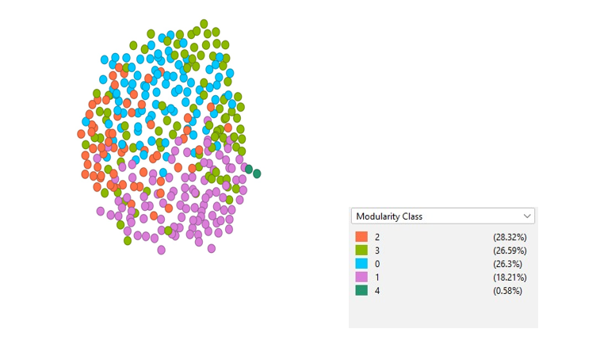

# Flights Project - Network Science Course

Repository for final project of Network Science Course at UNICAMP.

# Authors

| [ Leonardo Braz](https://github.com/lhleonardo)  Master's Student| [ Sadeeq Bello](https://github.com/Lekzyboi)  Master's Student|
| :---: | :---: |

Modularity is a measure used in network science to detect communities or clusters within a network. A community in a network is a group of nodes that have a high density of internal connections but a lower density of connections to nodes outside the community. In the context of this flight network, a community could a group of airports that have frequent flights between them but fewer flights to airports outside the community. This might correspond to regional groups of airports, airlines' operational networks, or other types of clusters.

The number of communities here is 5, which signifies that this network is divided into five distinct clusters or groups. Each of these communities represents a group of airports that are more closely interconnected with each other than they are with the rest of the network.

The modularity value ranges from -1 to 1, where a value close to 1 indicates strong community structure, and a value close to 0 or negative suggests that the network does not have a significant community structure, and it is more like a random network.

A modularity of this network is 0.277 which suggests that there is a moderate community structure in this network. The five communities detected may correspond to meaningful clusters of airports, but the modularity is not extremely high, suggesting that these community boundaries are not exceptionally strong.
